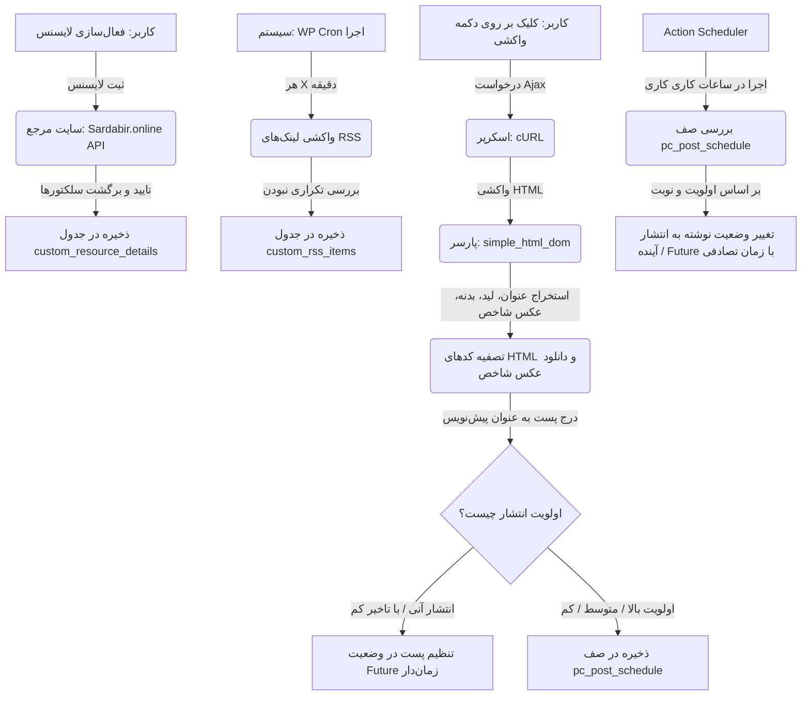

# راهنمای فنی و مستندات افزونه دستیار ناشر (Dastyar Nasher)
این سند به عنوان مرجع اصلی برای برنامه‌نویسان، توسعه‌دهندگان و سیستم‌های هوش مصنوعی کدنویسی تهیه شده است تا در کوتاه‌ترین زمان ممکن، ساختار فنی، نحوه کارکرد، جریان داده و مکانیزم‌های افزونه را بدون نیاز به بررسی تک‌تک خطوط کد درک کنند.

---

## ۱. نمای کلی پروژه و قابلیت‌های کلیدی
افزونه **دستیار ناشر (Dastyar Nasher)** یک کلاینت هوشمند وردپرسی برای خودکارسازی فرآیند گردآوری، پاک‌سازی، زمان‌بندی و انتشار اخبار و مقالات از فیدهای RSS منابع خبری مختلف است. 

### قابلیت‌های کلیدی:
* **واکشی هوشمند فیدها (RSS Reader):** بررسی خودکار فیدهای تعریف شده به صورت دوره‌ای و ذخیره لینک پست‌های جدید در پایگاه داده.
* **اسکرپر پیشرفته (Web Scraper):** واکشی بدنه اصلی خبر، خلاصه (لید)، عنوان و تصویر شاخص از لینک مبدا با کمک ساختار CSS Selectors داینامیک.
* **پاک‌سازی هوشمند محتوا:** حذف استایل‌ها، کلاس‌ها، آی‌دی‌ها، کدهای مخرب و لینک‌های منبع اصلی برای ارائه یک سند تمیز و بهینه‌شده جهت سئو.
* **سیستم زمان‌بندی انتشار هوشمند:** مدیریت صف انتشار پست‌ها با سه سطح اولویت (بالا، متوسط، پایین) و انتشار تدریجی آن‌ها در ساعات کاری تعیین‌شده با استفاده از کتابخانه قدرتمند **Action Scheduler**.
* **سیستم لایسنس و همگام‌سازی منابع:** تأیید اعتبار افزونه از طریق سرور مرکزی و دریافت تنظیمات CSS Selectors مربوط به هر رسانه خبری به صورت خودکار.
* **سیستم گزارش‌دهی دقیق (Logging):** ثبت جزئیات دقیق عملیات‌های موفق و خطاهای رخ‌داده در حین واکشی و اسکرپ جهت عیب‌یابی آسان.

---

## ۲. ساختار درختی فایل‌ها و پوشه‌ها
پروژه از یک ساختار ماژولار و تفکیک شده پیروی می‌کند:

```text
dastyar nasher/
├── admin-pages/                 # صفحات مدیریت وردپرس (UI/UX سمت ادمین)
│   ├── feeds_list.php           # صفحه نمایش فیدهای واکشی شده (داشبورد اصلی)
│   ├── license_page.php         # صفحه مدیریت لایسنس و نمایش اطلاعات اشتراک
│   ├── schedule-queue.php       # صفحه مدیریت صف انتشار پست‌های زمان‌بندی شده
│   └── setting_page.php         # تنظیمات ساعت کاری و بازه انتشار روزانه
├── assets/                      # فایل‌های CSS، JS، تصاویر و فونت‌ها
│   ├── css/                     # استایل‌های اختصاصی ادمین و فریمورک Bootstrap
│   ├── js/                      # جاوااسکریپت و کتابخانه‌های jQuery، SweetAlert2 و Select2
│   └── images/                  # آیکون‌ها و لوگوهای افزونه
├── inc/                         # هسته منطق برنامه و ارتباط با پایگاه داده
│   ├── crons/                   # وظایف زمان‌بندی شده پیش‌فرض وردپرس (WP Cron)
│   │   ├── crons.php            # مدیریت فواصل زمانی واکشی فیدها و همگام‌سازی تعداد پست‌ها
│   │   └── scheduling_post_publishing.php
│   ├── functions/               # توابع توزیع‌شده بر اساس ماژول
│   │   ├── crons.php            # مدیریت تسک‌های Action Scheduler و بازسازی خودکار صف
│   │   ├── feeds.php            # واکشی فیدهای RSS و ثبت موارد تکراری در پایگاه داده
│   │   ├── general.php          # توابع عمومی، فیلترهای صفحه‌بندی و غیرفعال‌سازی افزونه
│   │   ├── license.php          # مدیریت ارتباط با سرور لایسنس و ذخیره سلکتورها
│   │   ├── metabox.php          # افزودن متا باکس مدیریت زمان‌بندی در صفحه ویرایش نوشته
│   │   ├── post_schedule.php    # منطق صف انتشار، اولویت‌ها و محاسبات فواصل انتشار
│   │   ├── report.php           # توابع گزارش‌دهی (در حال حاضر خالی)
│   │   ├── scraper.php          # توابع اسکرپر (در حال حاضر خالی)
│   │   └── template.php         # توابع قالب (در حال حاضر خالی)
│   ├── scraper/                 # موتور اسکرپر و پردازش صفحات وب
│   │   ├── index.php            # کنترل‌کننده درخواست‌های Ajax واکشی نوشته و ثبت آن در وردپرس
│   │   ├── scraper_functions.php# توابع دانلود محتوا با cURL، تغییر انکودینگ آدرس‌ها و پاک‌سازی HTML
│   │   └── cookie.txt           # کوکی‌های موقت فرستاده شده با درخواست‌ها
│   ├── report/                  # سیستم گزارش‌دهی
│   │   └── index.php            # صفحه لاگ و گزارشات عملیات کلاینت
│   ├── db.php                   # ساخت جداول دیتابیس افزونه در فعال‌سازی ادمین
│   ├── functions_loader.php     # لودر اصلی توابع inc/functions و تعیین آدرس API سرور
│   └── icons.php                # کدهای SVG آیکون‌های استفاده شده در ادمین
├── library/                     # کتابخانه‌های خارجی استفاده شده در پروژه
│   ├── action-scheduler/        # کتابخانه اختصاصی مدیریت بهینه صف وظایف سنگین
│   ├── jdatetime.class.php      # کتابخانه کار با تاریخ‌های شمسی/جلالی
│   └── simple_html_dom.php      # پارسر سبک برای پردازش کدهای HTML صفحات وب
├── index.php                    # فایل اصلی افزونه (تعریف هدر، ثابت‌ها و لود وابستگی‌ها)
└── README.md                    # همین مستند راهنما
```

---

## ۳. فناوری‌ها، کتابخانه‌ها، هوک‌ها و APIها

### فناوری‌ها و زبان‌ها:
* **PHP 7.4+**: مفسر سمت سرور.
* **JavaScript (ES6+) / jQuery**: پردازش رویدادهای سمت کاربر و درخواست‌های AJAX.
* **Bootstrap 5 (RTL)**: برای استایل‌دهی و رسپانسیو سازی صفحات مدیریت.
* **CSS3 Vanilla**: استایل‌دهی شخصی‌سازی شده و شبیه‌سازی ظاهر پرمیوم.

### کتابخانه‌های جانبی (Libraries):
1. **Action Scheduler (توسعه یافته توسط ووکامرس):** برای مدیریت صف وظایف بدون مسدود کردن کارایی سرور یا مواجهه با محدودیت زمان اجرای اسکریپت (Timeout).
2. **jDateTime (i8_jDateTime):** برای تبدیل تاریخ میلادی ثبت پست‌ها و رویدادها به شمسی در ادمین.
3. **Simple HTML DOM Parser:** جهت تحلیل کدهای HTML صفحات وب واکشی شده و استخراج اطلاعات با استفاده از سلکتورها.
4. **SweetAlert2 & Select2:** جهت بهبود تجربه کاربری در فرم‌ها و پیام‌های سیستم.

### اتصالات API:
* **API خارجی (اعتبارسنجی لایسنس):**
  * آدرس سرور: `https://sardabir.online/wp-json/license/v1/validate/`
  * روش ارسال: POST
  * پارامترها: `subscription_secret_code` (کد لایسنس خریدار) و `subscription_site_url` (آدرس دامنه سایت).
  * خروجی: جزئیات طرح، زمان تمدید و همچنین آبجکت بزرگ `resources_data` شامل اطلاعات سلکتورهای CSS تمام خبرگزاری‌های مجاز.

### هوک‌های مهم وردپرس (Hooks):
* **فیلترها (Filters):**
  * `cron_schedules`: ثبت زمان‌بندی اختصاصی `i8_Scrap_Timing` برای واکشی دقیق فیدها.
  * `paginate_links`: تغییر ظاهر لینک‌های صفحه‌بندی پیش‌فرض ادمین به کلاس‌های بوت‌استرپ.
* **اکشن‌ها (Actions):**
  * `admin_init`: ایجاد جداول سفارشی دیتابیس در صورت عدم وجود.
  * `admin_menu`: ثبت منوی اصلی دستیار و زیرمنوهای (فیدها، صف انتشار، تنظیمات، لایسنس، گزارشات).
  * `save_post`: پردازش اولویت انتخابی نوشته پس از ذخیره‌سازی پست در پیش‌نویس.
  * `add_meta_boxes`: رندر جعبه تنظیمات اولویت و زمان‌بندی هوشمند در ویرایشگر نوشته وردپرس.
  * `wp_scheduled_delete` & `wp_login`: اجرای نامحسوس چک لایسنس روزانه و زمان ورود کاربران.
  * `wp_ajax_publish_scraper`: اجرای اسکرپر پس از فشردن دکمه واکشی ادمین.
  * `wp_ajax_i8_recreate_scheduled_action`: اکشن AJAX جهت بازیابی دستی صف در صورت بروز اختلال در Action Scheduler.

---

## ۴. جریان داده و ارتباط ماژول‌ها



---

## ۵. نصب، فعال‌سازی و پیکربندی اولیه
1. پوشه افزونه را در مسیر `wp-content/plugins/` آپلود کنید.
2. از بخش افزونه‌های وردپرس، افزونه **Dastyar Nasher** را فعال کنید. (پس از فعال‌سازی، جداول پایگاه داده به طور خودکار ایجاد می‌شوند).
3. به منوی **دستیار > لایسنس** مراجعه کرده و کد مخفی دریافتی از پنل سردبیر را وارد نموده و دکمه به‌روزرسانی را بزنید. در صورت معتبر بودن کد، لیست سلکتورها دانلود شده و لایسنس فعال می‌شود.
4. به بخش **دستیار > تنظیمات** رفته و پارامترهای زیر را تنظیم کنید:
   * **ساعت شروع کار کرون جاب:** برای مثال `07:00`
   * **ساعت پایان کار کرون جاب:** برای مثال `23:00`
   * **بازه عددی تعداد اخبار روزانه:** برای مثال حداقل `20` و حداکثر `30` خبر در روز.

---

## ۶. راهنمای توسعه و نگهداری کد

### اضافه کردن فیلتر یا ویژگی جدید به اسکرپر:
* کدهای مربوط به پردازش و تصفیه کدهای واکشی شده در فایل [scraper_functions.php](file:///Users/user/Sites/localhost/rasadi/wp-content/plugins/dastyar%20nasher/inc/scraper/scraper_functions.php) قرار دارند. برای نمونه برای حذف یک المان جدید از متن خبر، می‌توانید به آرایه `$tagsToRemove` در تابع `clear_not_allowed_tags()` اضافه کنید.

### توسعه و تغییر سلکتورها:
* سلکتورها به صورت سراسری از سمت وب‌سایت مرجع (Sardabir) مدیریت می‌شوند. با این حال اگر می‌خواهید به صورت محلی و دستی سلکتوری را تغییر دهید، می‌توانید فیلدهای جدول `wp_custom_resource_details` را ویرایش کنید.

---

## ۷. استانداردهای کدنویسی رعایت شده
* **استفاده از معماری پیشگیری از تداخل:** تمام توابع افزونه دارای پیشوند‌های یکتای `i8_` ، `cop_` یا `custom_` هستند تا از تداخل با سایر افزونه‌ها و قالب‌ها جلوگیری شود.
* **بررسی دسترسی امنیتی:** در تمام بخش‌های حساس و پردازش‌های AJAX از توابع `current_user_can('manage_options')` یا دسترسی `edit_posts` استفاده شده است.
* **استفاده از Nonce:** جهت ایمن‌سازی فرم‌ها و ارسال‌های AJAX در قبال حملات CSRF از مکانیزم `wp_verify_nonce` استفاده می‌شود.

---

## ۸. توابع کلیدی، کلاس‌ها، شورتکدها و جداول پایگاه داده

### جداول اختصاصی پایگاه داده (ساخته شده با `dbDelta`):
1. `{prefix}custom_rss_items`: ذخیره آخرین فیدهای خام خوانده شده از سایت‌های مرجع.
2. `{prefix}custom_resource_details`: ذخیره مشخصات، آدرس‌ها و سلکتورهای مربوط به هر خبرگزاری.
3. `{prefix}pc_post_schedule`: ذخیره صف انتشار پست‌هایی که وضعیت دستی‌شان اولویت‌بندی شده است.
4. `{prefix}pc_reports`: نگهداری گزارشات موفقیت یا شکست اسکرپ و وظایف خودکار سیستم.

### توابع شاخص سیستم:
* `send_license_validation_request($secret_code)`: ارسال درخواست اعتبار‌سنجی به سرور لایسنس.
* `scrape_and_publish_post($guid, $resource_id, $publish_priority)`: تابع اصلی اجرای فرآیند دانلود محتوا، تصفیه HTML، آپلود عکس شاخص و ثبت پست در پایگاه داده.
* `clear_not_allowed_tags($html, $base_url)`: حذف تگ‌ها و اتریبیوت‌های نامناسب با شیء `DOMDocument` و اصلاح مسیر عکس‌ها به مطلق.
* `calculate_post_publish_time()`: محاسبه دقیق فاصله زمانی انتشار پست‌ها بر مبنای ساعات کاری روزانه و تعداد خبر هدف.
* `i8_check_and_recover_scheduled_action()`: مکانیسم خودکار برای بررسی سلامت و حیات صف Action Scheduler و بازیابی خودکار آن در صورت لغو ناخواسته.

---

## ۹. نکات امنیتی و عملکردی
* **انتقال ایمن فرآیند کرون به Action Scheduler:** از آنجا که اجرای فرآیند اسکرپر و دانلود تصاویر سنگین است، صف طولانی انتشار به جای استفاده از کرون سنتی وردپرس با Action Scheduler و به صورت ناهمگام (Async) مدیریت می‌شود.
* **پاک‌سازی خودکار دیتابیس:** فیدهای قدیمی جدول `custom_rss_items` هر ۲۴ ساعت یک بار توسط ایونت `remove_all_feed_on_feeds_table` به طور کامل تخلیه می‌شوند تا از حجیم شدن بیهوده دیتابیس جلوگیری گردد.
* **سیستم مخفی بررسی لایسنس:** برای جلوگیری از کرک شدن آسان، تابع اعتبارسنجی لایسنس به صورت غیرمستقیم در هوک‌های پایه وردپرس مانند `wp_scheduled_delete` پنهان شده است.

---

## ۱۰. راهنمای رفع مشکلات رایج (FAQ)

#### چرا پست‌ها سر وقت منتشر نمی‌شوند؟
1. مطمئن شوید کرون جاب سیستم عامل روی سرور فعال است (تنظیم دستور `wget -q -O - http://yourdomain.com/wp-cron.php?doing_wp_cron >/dev/null 2>&1` در کرون جاب سی‌پنل یا دایرکت‌ادمین).
2. بازه ساعت کاری در بخش تنظیمات دستیار را چک کنید. سیستم در خارج از این ساعات پستی منتشر نمی‌کند.
3. Action Scheduler را بررسی کنید. در صورت نیاز از دکمه «بازیابی خودکار» در داشبورد صف انتشار برای احیای زمان‌بندی استفاده کنید.

#### چرا عکس‌های شاخص لود نمی‌شوند؟
* این موضوع به دلیل عدم دسترسی به تابع `media_sideload_image` رخ می‌دهد که نیاز به لود فایل‌های هسته ادمین وردپرس دارد. در صورتی که این مورد در کرون جاب رخ دهد، افزونه در فایل `functions_loader.php` فایل‌های کتابخانه‌ای وردپرس را به صورت اجباری لود می‌کند. همچنین ممکن است پسوند تصاویر در سایت مبدا استاندارد نبوده یا هاست شما اجازه ارتباط فرامرزی ندارد. لاگ دقیق خطا را در بخش **دستیار > گزارشات** مطالعه کنید.
